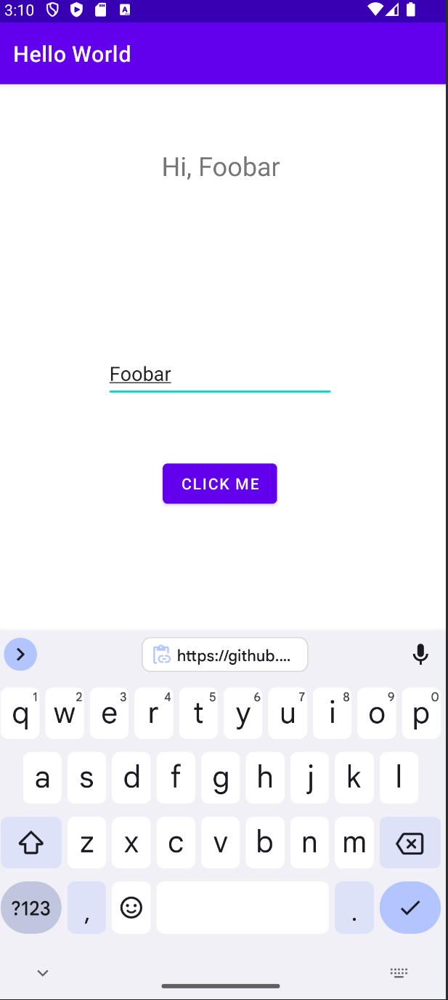

# HelloWorldLab
## About
HelloWorldLab is an Android app that shows a "Hello World" message, takes the user's name, and says "hi" to the user using their name afterwards.

## Screenshots
*Before:*

*After:*

## Getting started
First, download and configure GitHub in [Android Studio](https://github.com/ekourtakis/HelloWorldLab.git). Then clone repository in Android Studio and try running HelloWorldLab on your emulator. Try entering your name and clicking the button.

## Help
There is no support for HelloWorldLab. Sorry!